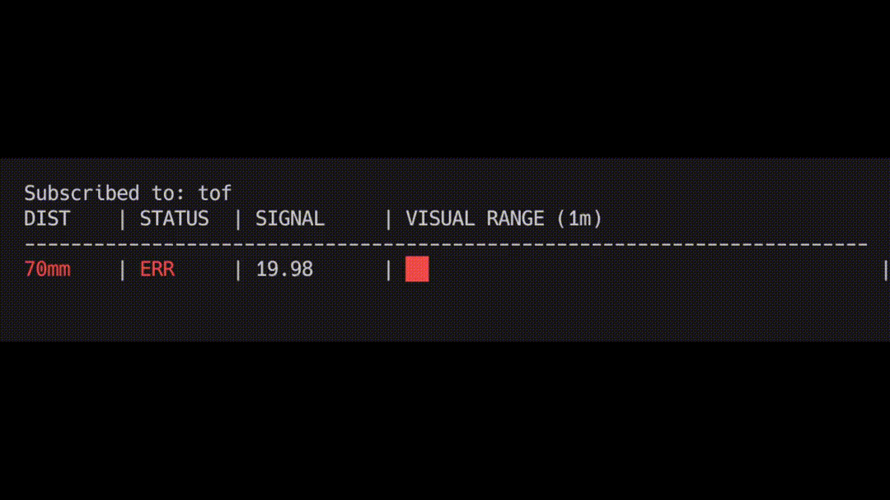

# vl53l4cx-orin-nano-zmq
Python driver for the VL53L4CX Time-of-Flight sensor, specifically optimized for the NVIDIA Jetson Orin Nano. This implementation bypasses the heavy Arduino HAL libraries, offering a lightweight ZeroMQ publisher for 4-wire (I2C) breakout boards. Ideal for low-latency robotics and proximity sensing.

**Ranging Profile: Short Range (Indoor Optimized)**

* **Effective Range:** 70mm – 1000mm
* **Accuracy:** Optimized for indoor lighting conditions
* **Performance:** Polling @ 100Hz

# 4-Wire Connection (I2C + Power)

    VL53L4CX                         Jetson Nano Header
    ┌─────────┐                      ┌────────────────┐
    │  ○ VIN  │──────────────────────│ Pin 1  (3.3V)  │
    │  ○ GND  │──────────────────────│ Pin 6  (GND)   │
    │  ○ SCL  │──────────────────────│ Pin 5  (SCL)   │
    │  ○ SDA  │──────────────────────│ Pin 3  (SDA)   │
    │  ○ XSHUT│ (optional)           │ Pin 7  (GPIO)  │
    │  ○ GPIO1│ (optional)           │                │
    └─────────┘                      └────────────────┘

Quick Test
==========

    $ sudo i2cdetect -y 1

         0  1  2  3  4  5  6  7  8  9  a  b  c  d  e  f
    00:          -- -- -- -- -- -- -- -- -- -- -- -- --
    10: -- -- -- -- -- -- -- -- -- -- -- -- -- -- -- --
    20: -- -- -- -- -- -- -- -- -- 29 -- -- -- -- -- --
    30: -- -- -- -- -- -- -- -- -- -- -- -- -- -- -- --

    If you see 29, the sensor is connected!
